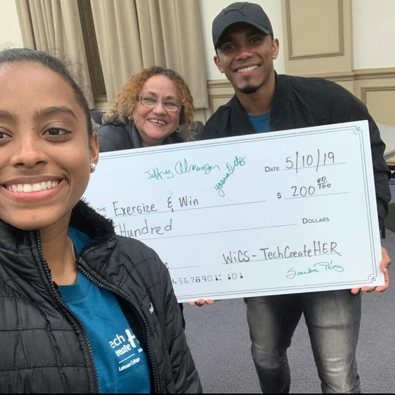
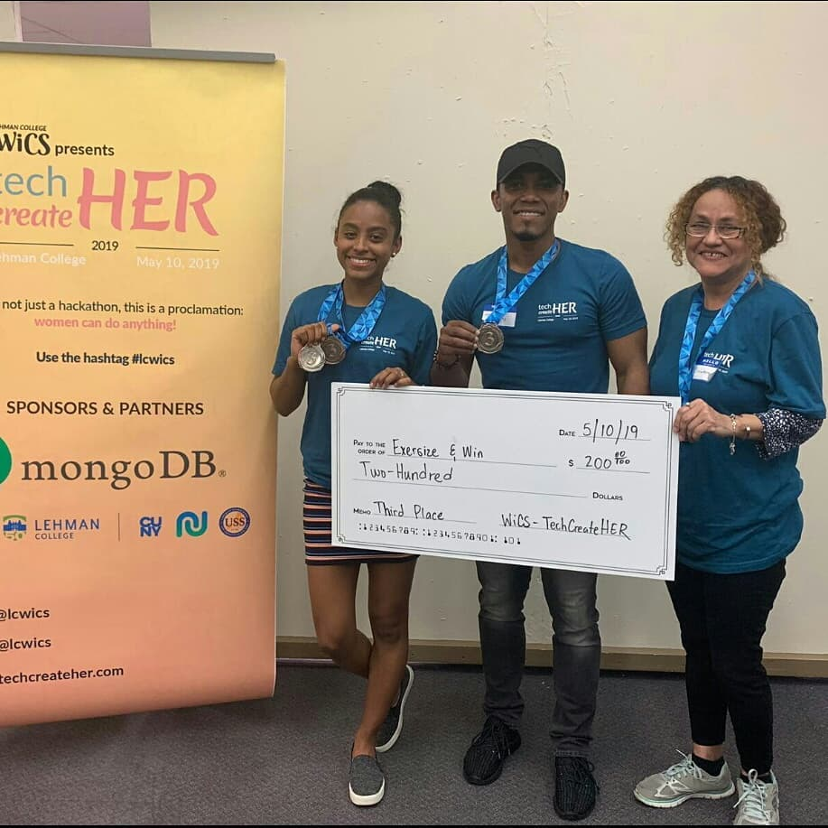

# teachheHackathon
# teachher Hackathon-project 
In less than 10 hours, two friends  and I developed this static website from scratch. They helped me with the images, colors, and videos, and I developed it. We made it to the third place. Demo: https://jeffrey-a.github.io/teachheHackathon/

# Here we are

